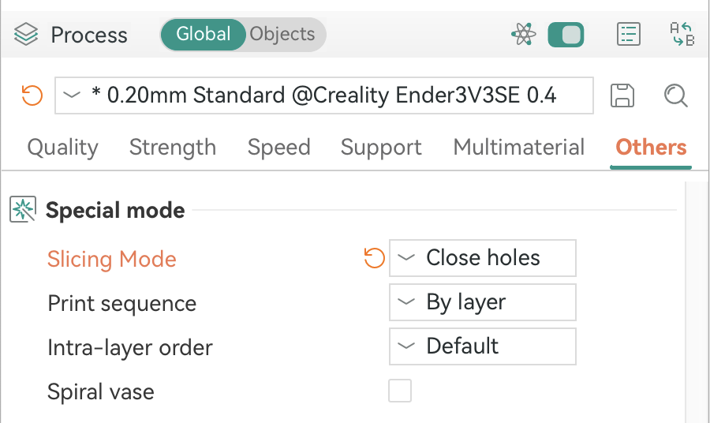

# Silakka54 v1.3 Slim Case

This is a remix of [Cheunwai](https://makerworld.com/en/models/1549507-silakka54-slim-screwless-case)'s version of the Silakka54 case adapted for `v1.3` version from AliExpress.

The extra space needed for the MCU and feet are achieved by adding negative geometries to the model. There is a version with the pegs and one without the pegs or holes, intended to be glued together, which is the way I use.

The added negative geometries are:
- two negative cubes around the MCU area to make enough clearance for `v1.3` PCB.
- two negative cylinders to add clearance for the feet of the keyboard.
- a negative cube that removes the pegs for pressure fitting.
- a negative cube that slightly reduces the size of the MCU cover as I found that it fits better that way.

For the right side, I've added a geometry that closes the controller port, as I don't need it to be accessible. If you need that port to be accessible, you can mirror the left side in your slicer software.

## Images
<!-- to be added -->

## Details
When printing the glued version, make sure that the `Close holes` option is selected under `Global > Other > Special mode > Slicing Mode` in your Slicer software:

